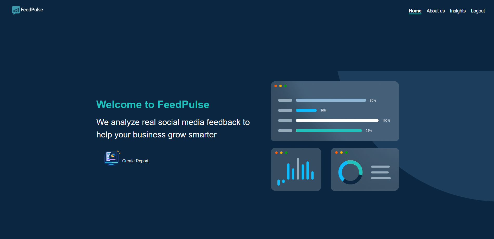
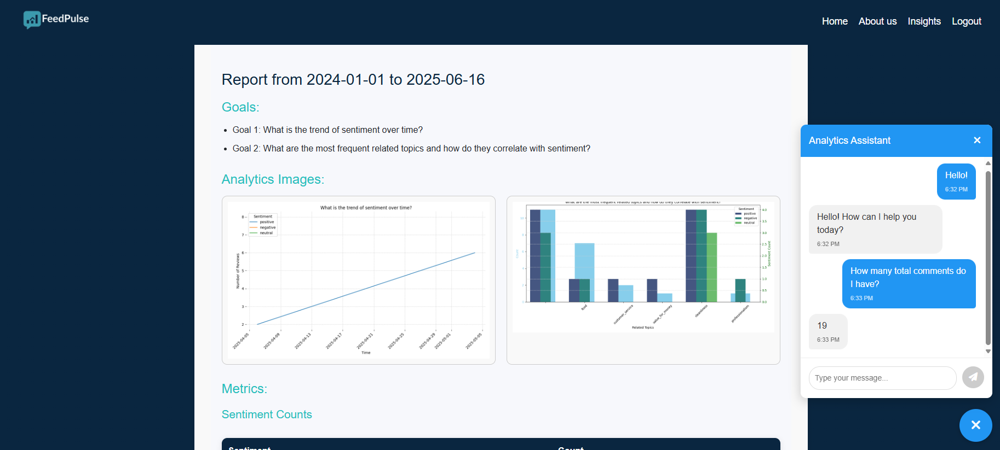
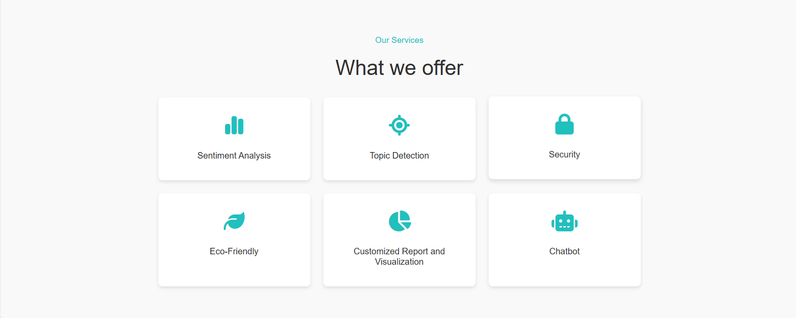

# 🎓 FeedPulse – Graduation Project

**FeedPulse** addresses the growing challenge of managing and making sense of the overwhelming volume of user feedback generated on social media platforms. Businesses and organizations often struggle to extract timely and actionable insights from this unstructured data, which is continuously generated across various channels. Manual analysis is not only inefficient but also prone to bias and delay.

To solve this, FeedPulse leverages advanced AI and big data technologies to automate the process of feedback analysis. It performs near real-time sentiment and topic classification on incoming comments from Facebook and Instagram, enabling decision-makers to react quickly to public opinion, detect emerging issues, and measure the impact of their campaigns—all while ensuring data privacy and scalability.

Additionally, FeedPulse features an interactive chatbot assistant that users can talk to in natural language. This chatbot can perform intelligent queries on the stored data, summarize key findings, and even generate visualizations such as sentiment charts or topic trends—making data exploration accessible to non-technical users.

---

## 📑 Table of Contents

- [Overview](#overview)
- [Features](#features)
- [Architecture](#architecture)
- [Tech Stack](#tech-stack)
- [Dataset and Storage](#dataset-and-storage)
- [CI/CD Pipeline](#cicd-pipeline)
- [Screenshots](#screenshots)
- [Team](#team)
- [License](#license)

---

## 🧠 Overview

You can access the live version of FeedPulse here: [https://feedpulse.vercel.app](https://feedpulse.vercel.app)


FeedPulse addresses the challenge of processing large volumes of user feedback on social media platforms. By leveraging AI and big data tools, the system delivers near real-time sentiment and topic classification, enabling timely and strategic decision-making.

---

## ✨ Features

- Facebook & Instagram comment ingestion (via Graph API webhooks)
- Near real-time sentiment and topic classification
- Parallel data processing using Apache Spark
- Auto-generated charts and summaries using Microsoft LIDA
- Interactive chatbot for generating insights, visualizations, etc...
- Android-based remote configuration tool (Twister)
- Privacy-preserving: No user identifiers are stored

---

## 🏗 Architecture

```
Angular (Vercel) <--> ASP.NET Web API (Azure App Service) <--> AI API (Azure VM with Spark)
                                                              ↕
                                                HDFS / Delta Lake / Trino
                                                              ↕
                                                   Twister (Android App)
```

---

## 🧰 Tech Stack

| Component | Technology |
|-----------|----------|
| Frontend  | Angular, TypeScript |
| Web API   | ASP.NET Core (C#) |
| AI API    | Python, Apache Spark, Delta Lake |
| Storage   | Delta Lake |
| CI/CD     | GitHub Actions |
| Cloud     | Azure VM, Azure App Service, Vercel |
| Twister   | Kotlin |

---

## 💾 Dataset and Storage

- Comments are ingested in real-time from the Facebook Graph API using the webhooks feature.
- All raw and processed data is stored in Delta Lake format on a distributed file system for scalability and reliability.
- **Redis** is used as an in-memory cache to enable fast and responsive interactions, especially for chatbot queries and visual exploration
- **Microsoft LIDA** automatically generates visual summaries and insights from the processed data, aiding non-technical users in understanding trends and patterns.

---

## 🚀 CI/CD Pipeline

- GitHub Actions handle:
  - Testing and linting
  - Deployment to Azure App Service and Vercel
---

## 🖼 Screenshots

🏠 Home Page



📊 Analytics Page



🧩 Services



🪜 Steps


---

## 👥 Team

- **Pavly Samuel** – Project Lead, AI, Backend, Frontend & CI/CD
- **John Ashraf** – Backend Lead
- **Aya Abdullatif** – AI, Backend & Frontend
- **Sara Khalifa** – AI, Backend, Frontend & CI/CD
- **Abdelrahman Ayman** – Backend
- **Marley Amged** – AI, Backend & CI/CD

---

## 📄 License

This project is developed as part of a graduation requirement and is subject to the university's academic usage policy.
